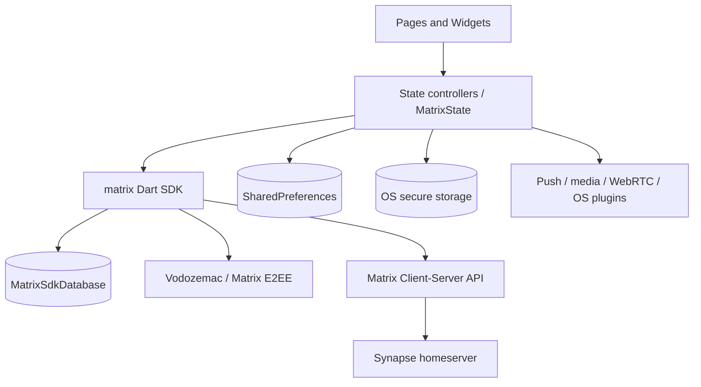

# Архитектура FluffyChat и практическое изучение клиента Matrix

> Документ относится к текущему состоянию этого репозитория (FluffyChat 2.8.0,
> Flutter/Dart) и рассчитан в том числе на начинающего разработчика. Имена
> классов и файлов приведены специально: по ним удобно переходить от текста к
> коду.

> **Статус документа.** Это итоговая, актуальная версия руководства. Она
> объединяет материал об архитектуре и библиотеках клиента с практическим
> руководством по локальному Synapse. Файлы с суффиксом `_preversion` являются
> промежуточными копиями и не должны использоваться или храниться рядом с этой
> версией.

### Как проверялась актуальность

Описание сверено с текущими точками входа и конфигурацией репозитория:

- версия приложения и перечень зависимостей — `pubspec.yaml`;
- запуск и восстановление Matrix-клиентов — `lib/main.dart` и
  `lib/utils/client_manager.dart`;
- composition root и глобальные подписки —
  `lib/widgets/fluffy_chat_app.dart` и `lib/widgets/matrix.dart`;
- дерево навигации — `lib/config/routes.dart`;
- настройки — `lib/config/setting_keys.dart`;
- локальная БД и её шифрование —
  `lib/utils/matrix_sdk_extensions/flutter_matrix_dart_sdk_database/`;
- локальный тестовый Synapse — `scripts/prepare_integration_test.sh` и
  `integration_test/synapse/`.

Если эти файлы существенно меняются, соответствующий раздел руководства также
нужно пересмотреть. Текст описывает именно реализацию в данном репозитории, а не
обещает неизменность API будущих версий Flutter, Matrix SDK или Synapse.

## Содержание

1. [Что это за проект](#1-что-это-за-проект)
2. [Карта репозитория](#2-карта-репозитория)
3. [Архитектура и запуск приложения](#3-архитектура-и-запуск-приложения)
4. [State Management](#4-state-management)
5. [Routing](#5-routing)
6. [Matrix SDK, сеть и синхронизация](#6-matrix-sdk-сеть-и-синхронизация)
7. [Хранение данных](#7-хранение-данных)
8. [Криптография и шифрование](#8-криптография-и-шифрование)
9. [Аутентификация и несколько аккаунтов](#9-аутентификация-и-несколько-аккаунтов)
10. [Сообщения, медиа, уведомления и звонки](#10-сообщения-медиа-уведомления-и-звонки)
11. [Адаптивный UI, платформы и локализация](#11-адаптивный-ui-платформы-и-локализация)
12. [Основные библиотеки](#12-основные-библиотеки)
13. [Тестирование](#13-тестирование)
14. [Запуск с локальным Synapse](#14-запуск-с-локальным-synapse)
15. [План изучения кода](#15-план-изучения-кода)
16. [Глоссарий и частые ошибки](#16-глоссарий-и-частые-ошибки)

---

## 1. Что это за проект

FluffyChat — свободный мультиплатформенный **клиент протокола Matrix**, написанный
на Flutter. Формулировка «клиент протокола Matrix-Synapse» неточна:

- **Matrix** — открытая спецификация обмена событиями, Client-Server API,
  федерации и end-to-end encryption (E2EE);
- **Synapse** — одна из реализаций Matrix homeserver;
- **FluffyChat** общается с homeserver по Matrix Client-Server API и поэтому не
  привязан исключительно к Synapse.

Упрощённо роли выглядят так:

```text
Flutter widgets
      │ действия пользователя / отображение состояния
      ▼
FluffyChat controllers + Matrix widget (application glue)
      │ Room, Timeline, Event, Client и их Stream
      ▼
matrix (Dart SDK)
      │ HTTPS: /_matrix/client/*, /_matrix/media/*
      ▼
Synapse или другой Matrix homeserver
      │ federation
      └────────────► другие homeserver
```

Synapse хранит серверную копию комнат и событий и маршрутизирует федерацию.
FluffyChat хранит локальный кэш, сессию, криптографическое состояние и
настройки. При E2EE сервер получает зашифрованное содержимое события, но всё
равно видит необходимую для доставки метаинформацию: комнату, отправителя,
время, устройства и размеры трафика. E2EE не означает анонимность.

Лицензия проекта — AGPL-3.0-or-later. Это важно учитывать при распространении
изменённой версии и предоставлении её как сетевого сервиса.

## 2. Карта репозитория

| Путь | Назначение |
|---|---|
| `lib/main.dart` | Entry point, инициализация Flutter, настроек, Vodozemac, клиентов и background mode. |
| `lib/widgets/fluffy_chat_app.dart` | Корневой `MaterialApp.router`, темы, локализация, app lock, `Matrix`. |
| `lib/widgets/matrix.dart` | Главный application-level coordinator: активный `Client`, аккаунты, подписки SDK, lifecycle, push, verification, VoIP. |
| `lib/config/routes.dart` | Всё дерево маршрутов `go_router`, redirects и adaptive shell. |
| `lib/config/` | Runtime-конфигурация, ключи настроек, темы, маршруты. |
| `lib/pages/` | Экраны. Часто логика находится в `foo.dart`, разметка — в `foo_view.dart`. |
| `lib/widgets/` | Переиспользуемые UI-компоненты и layout-компоненты. |
| `lib/utils/` | Интеграционный слой: SDK extensions, HTTP, push, файлы, вход, VoIP, БД. |
| `lib/l10n/` | ARB-переводы и генерируемая Flutter-локализация. |
| `assets/` | Логотипы, звуки, emoji SAS, web-артефакты Vodozemac. |
| `test/` | Widget/unit tests. |
| `integration_test/` | Сквозные сценарии и тестовая конфигурация Synapse. |
| `android/`, `ios/`, `linux/`, `macos/`, `windows/`, `web/` | Flutter runners и платформенная конфигурация. |
| `scripts/` | Сборка, подготовка web, интеграционных тестов и релизные операции. |

### Типичная структура экрана

Проект не следует строгой Clean Architecture с обязательными слоями
`domain/data/presentation`. Чаще используется практичная Flutter-схема:

```text
chat.dart       StatefulWidget + State-контроллер, команды и локальное состояние
chat_view.dart  build/UI, читает свойства и вызывает методы контроллера
widgets/...     небольшие части экрана
utils/...       общая или SDK-специфичная логика
```

Например, `ChatPage` находит `Room`, затем создаёт `ChatPageWithRoom`, а его
`State` называется `ChatController`. Контроллер держит `Timeline`, выбранные
события, reply/edit/thread state, scroll/focus controllers и методы отправки.
Это **controller-as-State**, а не отдельный глобальный BLoC.

## 3. Архитектура и запуск приложения

### 3.1 Последовательность старта

1. `main()` определяет integration-test mode.
2. На Android координирует основной и push-isolate.
3. На web нормализует URL hash для OIDC.
4. Вызывает `WidgetsFlutterBinding.ensureInitialized()`.
5. `AppSettings.init()` открывает `SharedPreferences` и на web подмешивает
   значения из `config.json`.
6. Инициализируется `flutter_vodozemac` — native/WASM crypto backend SDK.
7. `ClientManager.getClients()` читает имена аккаунтов, создаёт для каждого
   Matrix `Client`, подключает БД и восстанавливает сессии.
8. В обычном foreground mode `startGui()` читает PIN/biometrics из secure
   storage, дожидается загрузки rooms/account data первого клиента и вызывает
   `runApp(FluffyChatApp(...))`.
9. `FluffyChatApp` строит `MaterialApp.router`; над содержимым располагаются
   `AppLockWidget` и application coordinator `Matrix`.

В detached Android mode UI сразу не создаётся: клиенты запускаются без online
presence для обработки фоновых push, а `AppStarter` поднимет GUI при переходе
приложения в активное состояние.

### 3.2 Основные слои ответственности



- **UI** не формирует Matrix HTTP-запросы вручную; он работает с моделями и
  методами SDK (`Client`, `Room`, `Timeline`, `Event`).
- **Dart Matrix SDK** содержит основную протокольную и криптографическую логику.
- **FluffyChat glue code** связывает SDK с Flutter lifecycle, UI, push,
  платформенными API и продуктовыми настройками.
- **Локальная БД** — offline cache и постоянное состояние клиента, но не
  самостоятельный источник истины для всей Matrix-сети. История согласуется с
  homeserver через sync.

## 4. State Management

### 4.1 Здесь нет одного глобального Redux/BLoC

State Management гибридный. Это ключевой момент для чтения проекта:

| Масштаб состояния | Механизм | Пример |
|---|---|---|
| Локальное состояние экрана | `StatefulWidget`, `State`, `setState` | ввод и selection в `ChatController`, фильтры списка комнат |
| Реактивные данные SDK | `Stream`, `StreamBuilder`, подписки | sync, room updates, login state, notifications, verification |
| Одно async-вычисление | `FutureBuilder`, `AsyncSnapshot` | профиль, устройства, архив комнат |
| Небольшая observable-модель | `ValueNotifier`, `ValueListenableBuilder` | `SignInViewModel`, проигрываемое voice message |
| Application scope | пакет `provider` | `MatrixState` доступен через `Matrix.of(context)` |
| Постоянные настройки | `AppSettings` + `SharedPreferences` | тема, UI-флаги, Matrix behavior |
| Навигационное состояние | `GoRouter`/URL | активная комната, event, space, вложенный экран |

`Provider` здесь не является полноценным repository/state framework. В
`Matrix.build()` объект уже существующего `MatrixState` публикуется вниз по
дереву, а `Matrix.of(context)` использует `listen: false`. Поэтому изменение
поля `MatrixState` само по себе не перестраивает всех потребителей: нужны
`setState`, специализированный notifier/stream либо навигация.

### 4.2 Что считать source of truth

- Для комнат, событий, пользователей, устройств и crypto state — модели и БД
  Matrix SDK, обновляемые `/sync`.
- Для текущего UI-жеста — `State` конкретного экрана.
- Для выбранного аккаунта и общих lifecycle-процессов — `MatrixState`.
- Для route-dependent state — URL/path/query parameters.
- Для пользовательских предпочтений — `AppSettings`.

Не стоит копировать список событий из `Timeline` в собственный глобальный store:
это создаст второй источник истины. Лучше подписываться на API Timeline/Room.

### 4.3 Жизненный цикл реактивных данных

Пример получения нового сообщения:

```text
Synapse long-poll/sliding sync response
  → matrix SDK разбирает event
  → сохраняет/обновляет локальную БД и Room/Timeline
  → SDK Stream посылает notification
  → StreamBuilder/подписка инициирует rebuild
  → widget читает обновлённый Timeline и рисует Event
```

Для команды пользователя направление обратное:

```text
onPressed → controller method → Room/Client SDK method
  → локальный pending event / HTTP request
  → server acknowledgement и последующий sync
  → окончательный event state → rebuild
```

### 4.4 Практические правила при добавлении state

1. Если значение нужно только одному экрану — начинайте с поля `State` и
   `setState`.
2. Если данные уже предоставляет SDK как stream — не оборачивайте их в ещё один
   глобальный store без причины.
3. Если несколько далёких экранов должны менять application service — добавьте
   явно ограниченную ответственность в `MatrixState` либо отдельный provider.
4. Освобождайте `StreamSubscription`, `Timer`, `FocusNode`, controller и
   notifier в `dispose()`.
5. После `await` перед использованием `context` проверяйте `mounted`.
6. Не храните секреты в `SharedPreferences` и не помещайте чувствительные
   значения в route query.

## 5. Routing

Навигация построена на `go_router`. Статический `GoRouter` объявлен **вне
`build()`**, чтобы hot reload не сбрасывал текущий путь. `MaterialApp.router`
получает его как `routerConfig`.

### 5.1 Главные ветви

| Route | Экран/назначение |
|---|---|
| `/` | Redirect на `/rooms` или `/home` по login state. |
| `/home` | Intro и вложенные sign-in/sign-up/login routes. |
| `/logs`, `/configs` | Диагностические экраны. |
| `/backup` | Bootstrap/recovery после входа. |
| `/rooms` | Список комнат. |
| `/rooms/:roomid` | Timeline конкретной комнаты. |
| `/rooms/archive` | Архив/покинутые комнаты. |
| `/rooms/newprivatechat`, `/rooms/newgroup`, `/rooms/newspace` | Создание диалога, группы или Space. |
| `/rooms/settings/...` | Настройки приложения, homeserver, security, devices и т. п. |
| `/rooms/:roomid/details/...` | Детали, участники, permissions/access. |
| `/rooms/:roomid/encryption` | Состояние E2EE комнаты. |
| `/rooms/:roomid/search` | Поиск в комнате. |

Полный и актуальный список всегда следует читать в `lib/config/routes.dart`.

### 5.2 Guards и redirects

- `loggedInRedirect`: уже вошедшего пользователя уводит с auth route в
  `/rooms`.
- `loggedOutRedirect`: защищённый route отправляет неавторизованного
  пользователя в `/home`.
- Корневой redirect проверяет все клиенты (`any(client.isLogged())`).
- Глобальный redirect обрабатывает content sharing и Matrix deep links.

Это клиентская защита UX, а не security boundary: сервер всё равно проверяет
access token и permissions каждого API-запроса.

### 5.3 Path, query, fragment и `extra`

- `:roomid` — обязательный path parameter.
- `?event=...`, `?spaceId=...` — необязательное адресуемое состояние.
- fragment применяется для переданного deep link.
- `state.extra` передаёт уже созданные runtime-объекты (`Client`, `Timeline`).

`extra` удобно, но оно не переживает обычный reload/deep link на web. Поэтому
экран должен уметь восстановить основную сущность по ID; `ChatPage` именно так
получает комнату по `roomId`, если готового `Timeline` нет.

### 5.4 Адаптивные ShellRoute

В широком режиме `ShellRoute` строит `TwoColumnLayout`: слева остаётся список
комнат, справа — активная страница. Настройки имеют второй nested shell со своим
master/detail layout. На узком экране child занимает весь экран. Таким образом,
URL и бизнес-навигация едины, меняется только композиция представления.

Для shell route намеренно используется страница без transition: условная
перестройка по `MediaQuery` иначе может кратковременно создать два child с одним
`GlobalKey`.

## 6. Matrix SDK, сеть и синхронизация

Главная зависимость — пакет `matrix`. `ClientManager.createClient()` создаёт
отдельный `Client` для каждой локальной учётной записи и задаёт:

- custom HTTP client;
- локальную `MatrixSdkDatabase`;
- password и SSO login types;
- emoji/numeric key verification;
- native crypto implementations;
- dehydrated devices;
- стратегию передачи ключей (`shareKeysWith`);
- soft logout callback и таймаут отправки timeline event.

### 6.1 Важные модели SDK

- `Client` — сессия одного Matrix-устройства: homeserver, access token, sync,
  rooms, crypto и account data.
- `Room` — локальное представление комнаты и команды над ней.
- `Timeline` — загруженное окно событий комнаты, пагинация и live updates.
- `Event` — сообщение или state event. Matrix-комната фактически является
  последовательностью событий, а не набором специальных REST-сущностей.
- `User`/room member — участие пользователя в конкретной комнате.

### 6.2 Sync

После восстановления сессии SDK синхронизирует изменения с homeserver. Sync
token позволяет серверу вернуть дельту после предыдущего ответа. Limited
timeline означает, что между локальной и новой частью истории есть разрыв;
историю требуется догрузить. На mobile `MatrixState` меняет background sync и
стратегию запроса истории в зависимости от lifecycle.

### 6.3 State events и timeline events

- **Timeline event** обычно описывает действие во времени: сообщение, реакцию,
  редактирование, redaction.
- **State event** имеет пару `(type, state_key)` и задаёт текущее состояние:
  имя комнаты, membership, power levels, encryption и т. п.

Редактирование в Matrix — не мутация старой строки на сервере, а новое событие с
relation; удаление — redaction event. UI/SDK вычисляют эффективное отображение.

### 6.4 Сетевой слой

Приложение передаёт SDK `CustomHttpClient`. В зависимости от платформы он может
использовать подходящую HTTP-реализацию (включая Cronet на поддерживаемых native
целях). Медиа адресуются URI вида `mxc://...`; виджеты/extensions преобразуют их
в authenticated download/thumbnail requests.

Не смешивайте:

- homeserver URL — база Client-Server API;
- Matrix ID `@alice:example.org` — глобальный идентификатор пользователя;
- room ID `!opaque:example.org`;
- room alias `#readable:example.org`;
- `mxc://server/mediaId` — Matrix content URI.

## 7. Хранение данных

В клиенте несколько независимых механизмов хранения.

### 7.1 MatrixSdkDatabase

`flutterMatrixSdkDatabaseBuilder(clientName)` создаёт БД на каждый client name.
Она хранит восстановимую сессию SDK, комнаты, события, account/crypto data и
offline cache.

| Платформа | Реализация/место |
|---|---|
| Web | `MatrixSdkDatabase.init(clientName)`; браузерное persistent storage, запрашивается `navigator.storage.persist()`. |
| Native | SQLite через `sqflite_common_ffi`; файл `<clientName>.sqlite` в application support/library/app-group каталоге. |

На native создаётся `SQfLiteEncryptionHelper`, который применяет SQLCipher key
через `PRAGMA key`. Проектовый hook выбирает SQLCipher как SQLite source.
Существующие незашифрованные базы переводятся helper-ом в шифрованный формат,
а старое расположение файла мигрируется.

Если открыть БД не удалось, builder логирует ошибку, показывает notification,
удаляет повреждённый файл на native и создаёт базу заново. Это повышает
восстанавливаемость, но локально не синхронизированные данные/ключи могут быть
потеряны; recovery/backup поэтому принципиальны.

### 7.2 Ключ шифрования локальной БД

`getDatabaseCipher()`:

1. читает `database_password` из `flutter_secure_storage`;
2. при первом запуске генерирует `Random.secure()` 32 случайных байта;
3. сохраняет base64url-представление в Keychain/Keystore/libsecret-подобное
   защищённое хранилище платформы;
4. на iOS использует app group и умеет мигрировать legacy key;
5. если secure storage недоступен, возвращает `null` и предупреждает, что база
   не зашифрована.

Это **encryption at rest**, отдельное от Matrix E2EE.

### 7.3 SharedPreferences / `AppSettings`

Здесь находятся небольшие несекретные preferences: theme/цвет, уведомления,
рендер HTML, отправка typing/read receipts, default homeserver, активные фильтры,
список `clientName` для multi-account и т. п.

`AppSettings` — typed enum-like facade с default value и `setItem`. На web при
первом старте настройки могут быть заполнены из `config.json`; уже сохранённое
значение имеет приоритет. `config.sample.json` показывает доступный deployment
override, но текущим источником истины остаётся `AppSettings.values`.

`SharedPreferences` не гарантирует секретность. Access token и crypto material
должны оставаться в SDK database/secure mechanisms, пароль app lock — в
`FlutterSecureStorage`.

### 7.4 Файлы и media cache

Native builder создаёт `fluffychat_download_cache` в cache/temp или iOS app
group. SDK получает лимит файла 10 MB для этого storage и срок удаления 30 дней.
Выбранные пользователем downloads и временный кэш — разные понятия: очистка
кэша не удаляет событие с homeserver.

### 7.5 Серверное хранение

Локальная БД FluffyChat и БД Synapse не заменяют друг друга:

| Данные | Клиент | Synapse |
|---|---:|---:|
| Зашифрованное событие комнаты | кэш | да |
| Plaintext E2EE-сообщения | после расшифровки локально | нет, если E2EE корректно включён |
| Olm/Megolm keys | да | только предназначенные для доставки key payloads/backup в зашифрованном виде |
| Access/session state | да | серверная session/device запись тоже существует |
| Незашифрованное сообщение | кэш | да, plaintext |
| Загруженное media | кэш | да; при E2EE media ciphertext и ключ/IV идут в encrypted file metadata |

## 8. Криптография и шифрование

### 8.1 Три разных уровня

1. **TLS/HTTPS** защищает транспорт клиент ↔ homeserver. Для production это
   обязательно, но homeserver видит plaintext незашифрованной комнаты.
2. **Matrix E2EE** защищает содержимое событий между устройствами участников.
3. **SQLCipher at rest** защищает локальный SQLite-файл украденного/скопированного
   устройства. Он не шифрует сетевой трафик.

### 8.2 Olm, Megolm и Vodozemac

На концептуальном уровне Matrix использует:

- Olm-подобные pairwise encrypted sessions между устройствами для доставки
  секретов/room keys;
- Megolm group sessions для эффективного шифрования timeline комнаты;
- device identity keys, one-time/fallback keys и подписи;
- cross-signing для установления доверия между устройствами аккаунта.

FluffyChat не реализует эти примитивы вручную. Dart Matrix SDK управляет
протоколом, а `flutter_vodozemac`/Vodozemac предоставляет проверенную native/WASM
реализацию криптографических операций. В `main()` backend инициализируется до
работы клиентов; для web указан путь к WASM assets, для native SDK может вынести
тяжёлую работу в isolate.

Упрощённая отправка E2EE-сообщения:

```text
plaintext в ChatController
  → SDK проверяет encryption state комнаты и outbound group session
  → шифрует event content ключом Megolm session
  → ключ session безопасно рассылается допустимым устройствам
  → Synapse хранит и доставляет m.room.encrypted
  → SDK получателя на доверенном устройстве получает room key
  → локально расшифровывает event и отдаёт UI
```

### 8.3 Trust, verification и cross-signing

Новый login создаёт новое Matrix-устройство. Пользователь сравнивает emoji или
числа SAS (Short Authentication String) на двух устройствах. Совпадение
подтверждает, что обмен ключами не подменён. `ClientManager` включает numeric
verification везде, emoji — на поддерживаемых целях. `MatrixState` слушает
`onKeyVerificationRequest` и показывает `KeyVerificationDialog`.

Cross-signing позволяет доверенному устройству подписывать новое и переносить
доверие на уровень аккаунта, а не вручную доверять каждой паре. UI security и
device settings является оболочкой над SDK API для этих операций.

### 8.4 Room key requests и missing keys

Если устройство видит encrypted event, но не имеет нужного Megolm session key,
оно не может показать plaintext. Причины: устройство вошло позже, отправитель не
разрешил sharing, устройство не верифицировано, пропущен to-device event или нет
backup.

`MatrixState` слушает `onRoomKeyRequest`. Запрос от другого локального клиента с
тем же user ID и совпадающим identity key автоматически форвардится. Для других
случаев решение принимает crypto policy SDK/user flow, а не UI «обходит» E2EE.

### 8.5 Backup/recovery и dehydrated devices

Encrypted key backup нужен, чтобы восстановить исторические Megolm keys на
новом устройстве. Route `/backup` открывает bootstrap/recovery flow после login.
`Client` создаётся с поддержкой dehydrated devices — сервер может хранить
зашифрованное состояние неактивного устройства для более бесшовного входа.

Важно различать:

- пароль Matrix-аккаунта;
- recovery key/passphrase для key backup/secret storage;
- PIN локального app lock;
- случайный SQLCipher password.

Это разные секреты с разным назначением. Потеря recovery material при отсутствии
старого устройства может сделать старые E2EE-сообщения необратимо нечитаемыми.

### 8.6 Ограничения модели угроз

- Скомпрометированный клиент до шифрования/после расшифрования видит plaintext.
- Добавленное злоумышленником устройство опасно до обнаружения/отзыва; проверяйте
  список устройств.
- Push payload следует минимизировать: приложение поддерживает формат
  `event_id_only`, после чего само забирает событие.
- Скриншоты, clipboard, notifications и скачанный plaintext требуют отдельной
  платформенной защиты.
- Не отключайте TLS certificate verification ради локального удобства в
  production.

## 9. Аутентификация и несколько аккаунтов

### 9.1 Discovery и login

Sign-in flow выбирает homeserver, проверяет его capabilities/login flows, затем
использует password либо SSO. Для web/mobile SSO/OIDC применяется browser redirect
и deep link/callback. UIA (`User-Interactive Authentication`) обрабатывает
многошаговые серверные проверки для чувствительных действий.

`SignInViewModel` — один из немногих явных MVVM-подобных участков: он наследует
`ValueNotifier<SignInState>`, загружает список публичных homeserver, фильтрует его
и хранит `AsyncSnapshot` загрузки.

### 9.2 Multi-account

- `SharedPreferences` хранит только список стабильных `clientName`.
- На каждый client name создаётся отдельный `Client` и отдельная БД.
- `MatrixState` выбирает активный client и поддерживает account bundles.
- После успешного login временный candidate добавляется в список, регистрируются
  подписки, он становится активным, затем router переходит в `/backup`.
- При logout подписки отменяются, client удаляется из списка и очищается session
  backup. Последний logout возвращает приложение к `/`.

`clientName` — локальный ключ экземпляра, а не Matrix user ID.

## 10. Сообщения, медиа, уведомления и звонки

### 10.1 Timeline и composer

`ChatController` концентрирует взаимодействие с комнатой:

- получение/создание `Timeline` и пагинация истории;
- send/edit/reply/redact/react;
- threads и relations;
- typing state с timers;
- read marker/receipts;
- selection и bulk actions;
- drag-and-drop, file/image/location/audio sending.

Передача файлов проходит через picker/cross-file, MIME detection, preview/crop/
resize/compress по типу и платформе, затем SDK media upload и message event.
`image`, `native_imaging`, `video_compress`, `crop_image`, `blurhash_dart` и
media widgets обслуживают эту цепочку.

### 10.2 Push notifications

Matrix pusher сообщает push gateway о новом событии; gateway доставляет FCM,
UnifiedPush либо платформенный сигнал. FluffyChat регистрирует pusher, обрабатывает
background isolate/service и показывает local notification через
`flutter_local_notifications`. Web использует browser Notifications API.

Push — сигнал о событии, а не источник состояния. После пробуждения клиент
синхронизируется с homeserver. Это особенно важно для E2EE: plaintext не должен
без необходимости уходить стороннему push provider.

### 10.3 VoIP

Экспериментальный `VoipPlugin` включается настройкой. Media plane использует
`flutter_webrtc`/`webrtc_interface`, камера/микрофон управляются в `utils/voip`,
а Matrix-события используются как signaling. `wakelock_plus` не даёт устройству
заснуть во время сценария, `handy_window`/PiP помогают desktop/mobile UI.

Matrix signaling и WebRTC media — разные уровни. Для звонков через сложные NAT
в реальном развёртывании обычно нужен TURN; одного Synapse недостаточно.

## 11. Адаптивный UI, платформы и локализация

- Material 3/Material You, light/dark themes и dynamic system colors.
- `FluffyThemes.isColumnMode(context)` выбирает mobile navigation либо
  two-column desktop/tablet layout.
- `PlatformInfos` централизует feature detection вместо разбросанных проверок
  ОС.
- `universal_html` закрывает web-specific APIs условно совместимым импортом.
- ARB-файлы в `lib/l10n` генерируют `L10n`; строки UI не следует hardcode-ить.
- Платформенные permissions и capabilities различаются: secure storage,
  biometrics, background execution, file paths, notifications и emoji SAS могут
  быть доступны не везде.

## 12. Основные библиотеки

Ниже не механический пересказ `pubspec.yaml`, а группировка по роли.

### 12.1 Основа

| Библиотека | Роль |
|---|---|
| `flutter`, `flutter_localizations` | UI framework, platform runners, i18n. |
| `matrix` | Matrix Client-Server API, sync, модели, timeline, E2EE orchestration и БД SDK. |
| `provider` | Публикация `MatrixState` в widget tree. |
| `go_router` | Declarative URL routing, nested/shell routes, redirects, deep links. |
| `async`, `collection` | Async helpers и безопасные операции над коллекциями. |

### 12.2 Безопасность и локальные данные

| Библиотека | Роль |
|---|---|
| `flutter_vodozemac` | Matrix crypto primitives через native/WASM Vodozemac. |
| `flutter_secure_storage` | SQLCipher key, app-lock data и другие малые секреты в OS vault. |
| `sqflite_common_ffi` | Native SQLite/SQLCipher доступ для Matrix SDK database. |
| `shared_preferences` | Несекретные настройки и список локальных client instances. |
| `local_auth` | Биометрическая разблокировка приложения. |
| `path`, `path_provider`, `path_provider_foundation` | Безопасный выбор application/cache directories. |

### 12.3 Сеть, auth и интеграция ОС

| Библиотека | Роль |
|---|---|
| `http`, `cronet_http` | HTTP и оптимизированный native transport. |
| `flutter_web_auth_2` | Browser-based SSO/OIDC callbacks. |
| `url_launcher` | Открытие внешних ссылок/auth URL. |
| `flutter_local_notifications`, `unifiedpush*`, `flutter_foreground_task`, `flutter_new_badger` | Push/local notifications, background service, badge. |
| `device_info_plus`, `package_info_plus` | Runtime сведения об устройстве/приложении. |
| `receive_sharing_intent`, `share_plus`, `pasteboard` | OS share/clipboard integration. |

### 12.4 Медиа и UX

| Библиотека | Роль |
|---|---|
| `image_picker`, `file_picker`, `file_selector`, `cross_file`, `desktop_drop` | Выбор и drag-and-drop файлов. |
| `image`, `native_imaging`, `crop_image`, `video_compress`, `blurhash_dart` | Обработка/preview изображений и видео. |
| `video_player`, `chewie`, `just_audio`, `record`, `opus_caf_converter_dart` | Playback/recording аудио и видео. |
| `flutter_webrtc`, `webrtc_interface` | Calls/media streams. |
| `geolocator`, `flutter_map`, `latlong2` | Геопозиция и карта. |
| `emoji_picker_flutter`, `badges`, `pretty_qr_code`, `qr_code_scanner_plus` | Composer и вспомогательный UI/QR flows. |
| `html`, `flutter_linkify`, `highlight` | Sanitized/rich text, ссылки, code highlighting. |

При изучении API библиотеки сверяйтесь с зафиксированной версией в
`pubspec.lock`, а не только с последней документацией в интернете: API мог
измениться.

## 13. Тестирование

### 13.1 Unit/widget tests

```bash
flutter pub get
flutter analyze
flutter test
```

`test/` содержит widget tests архива, homeserver picker, command hints и базового
приложения. `test/utils/test_client.dart` помогает создать SDK client для теста.

### 13.2 Integration tests

Репозиторий уже содержит минимальный Synapse testbed:

```bash
./scripts/prepare_integration_test.sh
flutter test integration_test/mobile_test.dart
```

Скрипт:

1. удаляет старый контейнер `synapse`;
2. запускает `matrixdotorg/synapse:latest` с `tmpfs /data`;
3. монтирует тестовые `homeserver.yaml`, logging config и открывает порт 80;
4. ждёт `/_matrix/client/v3/login`;
5. регистрирует двух тестовых пользователей.

Это **одноразовая тестовая среда**, не production: данные находятся в tmpfs,
регистрация без verification включена, задан тестовый shared secret, HTTP без
TLS, SQLite и floating tag `latest`.

Сценарии находятся в `integration_test/flows`: authentication, basic messaging,
chat backup и multi-account. Это хороший executable tour по пользовательским
потокам.

## 14. Запуск с локальным Synapse

### 14.1 Самый быстрый путь: встроенный testbed

Требуются Flutter подходящей версии, Rust (для crypto/build tooling), Docker и
свободный порт 80.

```bash
cd /path/to/fluffychat
./scripts/prepare_integration_test.sh
curl http://localhost/_matrix/client/versions
docker logs -f synapse
```

Учётные данные смотрите в `integration_test/data/integration_users.env`. Затем
запустите клиент и в homeserver picker укажите URL:

```bash
flutter pub get
flutter run
```

Для desktop клиента обычно подходит `http://localhost`. В браузере возможны
CORS/mixed-content ограничения, а из Android emulator `localhost` означает сам
эмулятор: адрес host обычно `10.0.2.2`. В iOS Simulator обычно доступен host
localhost; на физическом телефоне используйте LAN IP компьютера и разрешите
cleartext только для development либо настройте HTTPS.

Тестовая конфигурация имеет `server_name: localhost`. Нельзя просто заменить URL
на произвольный IP после создания пользователей и ожидать, что Matrix IDs и
federation domain изменятся: server name является частью идентичности сервера.

Остановить среду:

```bash
docker rm -f synapse
```

### 14.2 Более реалистичный постоянный стенд

Для отдельного сервера Debian 13 в локальной сети и проверки официальными
версиями FluffyChat на iPhone, iPad и Android используйте отдельную подробную
инструкцию: [`SYNAPSE_DEBIAN13_LAN_RU.md`](SYNAPSE_DEBIAN13_LAN_RU.md). Ниже
оставлен более короткий Docker-вариант, удобный для локальной разработки.

Для учебного стенда, данные которого переживают restart, сначала сгенерируйте
конфигурацию в отдельной директории:

```bash
mkdir -p "$PWD/.local/synapse-data"
docker run --rm -it \
  -v "$PWD/.local/synapse-data:/data" \
  -e SYNAPSE_SERVER_NAME=matrix.local.test \
  -e SYNAPSE_REPORT_STATS=no \
  matrixdotorg/synapse:latest generate

docker run -d --name fluffychat-synapse \
  -v "$PWD/.local/synapse-data:/data" \
  -p 8008:8008 \
  matrixdotorg/synapse:latest
```

Добавьте `matrix.local.test` в hosts/DNS так, чтобы **клиентское устройство**
разрешало имя в IP Docker host. Создайте пользователя штатной командой Synapse:

```bash
docker exec -it fluffychat-synapse \
  register_new_matrix_user -c /data/homeserver.yaml http://localhost:8008
```

После этого укажите в FluffyChat `http://matrix.local.test:8008`. Для Android
emulator hosts host-машины автоматически не наследуется; проще использовать
доступное эмулятору имя/IP или локальный DNS.

**Не коммитьте** generated signing keys, registration secrets, БД и access
tokens. Для воспроизводимости зафиксируйте конкретный Synapse image tag вместо
`latest`.

### 14.3 Что необходимо для production-like стенда

Минимальный следующий шаг:

1. DNS-имена для Matrix server name и публичного client endpoint.
2. Reverse proxy (например, nginx/Caddy/Traefik) и валидный TLS certificate.
3. Корректный `public_baseurl` и `.well-known/matrix/client`; для федерации —
   `.well-known/matrix/server` или корректный порт/делегирование.
4. PostgreSQL вместо SQLite для серьёзной нагрузки.
5. Persistent volumes, backup и проверенная процедура restore.
6. Закрытая публичная регистрация либо verification/token policy.
7. TURN server для надёжных WebRTC-звонков.
8. Push gateway/UnifiedPush strategy, если проверяете background mobile push.
9. Rate limits, log rotation, monitoring, обновления и секреты вне Git.

Synapse deployment и FluffyChat web deployment — два разных сервиса. Web build
можно собрать так:

```bash
./scripts/prepare-web.sh
flutter build web --release
```

Рядом с web assets можно отдать `config.json`, например:

```json
{
  "defaultHomeserver": "matrix.local.test",
  "presetHomeserver": "https://matrix.local.test"
}
```

При web-развёртывании homeserver должен разрешать origin клиента по CORS, а
HTTPS-страница не сможет безопасно обращаться к HTTP homeserver из-за mixed
content. Используйте HTTPS с обеих сторон.

### 14.4 Ручной smoke test

Создайте Alice и Bob и последовательно проверьте:

1. login Alice, затем Bob на другом client/device;
2. создание незашифрованной комнаты и обмен сообщениями;
3. создание private encrypted room;
4. до verification убедитесь, как UI показывает trust/missing keys;
5. SAS verification emoji/числа между устройствами;
6. отправка текста и файла в E2EE room;
7. restart клиента и Synapse, проверка local cache и повторного sync;
8. login Alice на новом устройстве и восстановление key backup;
9. logout старого устройства/revoke session;
10. offline send, reconnect и разрешение pending event;
11. edit, reaction, reply, redaction, read receipt и typing;
12. если настроены TURN/push — звонок и background notification.

Для диагностики параллельно полезны:

```bash
docker logs -f synapse
curl -s http://localhost/_matrix/client/versions
flutter run --verbose
```

Не публикуйте verbose logs без просмотра: URL, Matrix IDs, event metadata и
иногда auth-related данные могут быть чувствительными.

## 15. План изучения кода

### Этап 1. Каркас Flutter

1. `lib/main.dart` — нарисуйте sequence запуска.
2. `lib/widgets/fluffy_chat_app.dart` — найдите composition root.
3. `lib/config/routes.dart` — выпишите route tree.
4. `lib/widgets/matrix.dart` — отметьте application-wide services/subscriptions.

**Задание:** добавьте временный breakpoint в redirect и проследите `/` →
`/home` → login → `/backup` → `/rooms`.

### Этап 2. Один вертикальный срез

Читайте не весь репозиторий подряд, а сценарий «открыть комнату и отправить
сообщение»:

1. `chat_list.dart`/`chat_list_view.dart`;
2. route `/rooms/:roomid`;
3. `chat.dart`/`chat_view.dart`;
4. методы `Room`/`Timeline` в зафиксированной версии Matrix SDK;
5. наблюдайте запрос и последующий sync в логах.

**Задание:** найдите, где возникает pending event, где он получает server event
ID и как UI обрабатывает failure/retry.

### Этап 3. Persistence

1. `client_manager.dart`;
2. database `builder.dart` и `cipher.dart`;
3. `setting_keys.dart`;
4. запустите client, закройте сеть, перезапустите и проверьте доступный cache.

**Задание:** разделите наблюдаемые данные на preferences, SDK DB, secure storage,
file cache и homeserver DB.

### Этап 4. E2EE

1. `settings_security`, `device_settings`, `key_verification`;
2. crypto subscriptions в `MatrixState`;
3. `init_with_restore.dart` и bootstrap route;
4. encrypted room между двумя устройствами.

**Задание:** зафиксируйте четыре состояния: ключ есть/нет, устройство trusted/
untrusted. Не экспериментируйте на аккаунте без сохранённого recovery key.

### Этап 5. Platform integrations

По очереди изучите `background_push.dart`, notification handlers, file selector,
media dialogs и `utils/voip`. Для каждого выпишите:

- общий Dart interface;
- platform branch/plugin;
- permission;
- foreground/background lifecycle;
- fallback при отсутствии capability.

### Как безопасно вносить изменения

```bash
dart format lib test integration_test
flutter analyze
flutter test
```

Для изменения route добавьте deep-link/reload test. Для изменения crypto flow не
пишите собственные crypto primitives и обязательно тестируйте два устройства,
unverified state, missing key и restore. Для persistence проверяйте upgrade со
старой БД, а не только чистую установку.

## 16. Глоссарий и частые ошибки

| Термин | Простое объяснение |
|---|---|
| Homeserver | Сервер, на котором зарегистрирован Matrix-аккаунт и который участвует в доставке/федерации. |
| Synapse | Конкретная реализация homeserver, не название клиентского протокола. |
| Federation | Обмен событиями между разными homeserver. Для теста одного сервера необязателен. |
| Room | Распределённый журнал Matrix events со state. DM тоже является room. |
| Device | Отдельная crypto/session identity одного login, не обязательно физический аппарат. |
| Sync token | Позиция клиента в потоке серверных изменений. |
| E2EE | Шифрование содержимого между конечными устройствами. |
| Verification | Внешняя проверка, что crypto identity второго устройства настоящая. |
| Cross-signing | Цепочка подписей, позволяющая переносить доверие между устройствами аккаунта. |
| Key backup | Зашифрованная серверная резервная копия room keys, а не plaintext истории. |
| MXC URI | Ссылка Matrix на media; для загрузки требуется преобразование в HTTP API request. |
| Power level | Числовая Matrix-модель разрешений действий в комнате. |
| UIA | Многоэтапная повторная аутентификация для чувствительной операции. |

### Частые неверные предположения

- «Synapse расшифрует E2EE при поиске» — нет; server-side поиск plaintext для
  корректно E2EE-события невозможен без утечки ключей.
- «Пароль аккаунта автоматически восстанавливает всю encrypted history» — не
  обязательно; нужен доступ к старому trusted device или настроенному recovery.
- «`setState` означает плохую архитектуру» — нет; для локального widget state это
  наиболее прямой механизм. Проблема начинается при дублировании domain state.
- «Provider автоматически следит за всеми полями `MatrixState`» — нет, здесь
  `Matrix.of` читает provider без подписки.
- «`state.extra` достаточно для web URL» — нет; после reload runtime object
  потерян.
- «Локальный HTTP подходит для production» — нет; он допустим только в
  контролируемом стенде.
- «Очистка приложения удалит сообщения у всех» — нет; локальный cache и серверные
  events имеют разный lifecycle.

---

## Короткая схема для запоминания

```text
go_router выбирает экран
  → StatefulWidget/StreamBuilder управляет представлением
  → MatrixState выбирает Client и связывает платформенные сервисы
  → matrix SDK управляет Room/Timeline/Event/sync/E2EE
  → MatrixSdkDatabase даёт offline state
  → Synapse обслуживает Client-Server API и (при необходимости) federation
```

Лучший способ изучить проект — держать два тестовых клиента, открытый
`docker logs -f synapse`, Flutter debugger и читать один пользовательский поток
вертикально: от нажатия в widget до SDK event, HTTP/sync и обратного rebuild UI.
